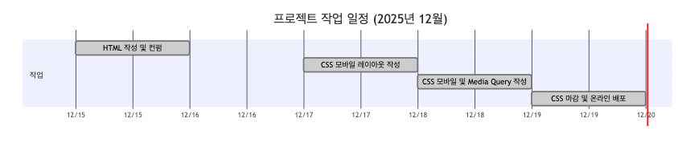

# landing-page

랜딩페이지 반응형 구현

## 1. 프로젝트 소개

- 호두의 하루 - 기묘한 반려묘 '호두'의 일상 소개 & 뉴스레터 구독 랜딩 페이지

본 프로젝ㅌ트는 고양이 '호두'의 일상을 주제로 한 랜딩 페이지로,
귀여운 호두의 일상 사진 위주의 콘텐츠를 통해 사용자가 자연스럽게 페이지를 탐색하고
블로그 뉴스레터 구독으로 이어지도록 유도하는 것을 목표로 제작되었습니다.

HTML과 CSS만을 사용하여 페이지 구조와 스타일링을 구현하였으며,
SNS 공유 시 미리보기 카드가 정상적으로 노출되도록
Open Graph 및 Twitter Card 메타 태그를 적용하였습니다.

## 2. 목표와 기능

### 1.1 목표

- 반려묘 '호두'의 일상을 매력적으로 전달하는 랜딩 페이지 구현
- 사용자가 페이지의 흐름에 따라 뉴스레터 구독에 관심을 갖도록 유도
- HTML, CSS 기반의 시맨틱 마크업 및 반응형 레이아웃 연습
- 메타 태그 (Open Graph, Twitter Card)를 활용한 링크 공유 최적화

### 1.2 기능

- 콘텐츠 중심 랜딩 페이지 : 반려묘 '호두'의 일상 소개 텍스트 및 이미지 구성
- 뉴스레터 구독 유도 UI : 사용자의 행동을 유도하는 버튼 및 섹션 배치
- 반응형 웹 구현 : 모바일, 태블릿, 데스크톱 환경에 대응하는 CSS 레이아웃
- 웹 접근성 고려 : 시맨틱 태그 사용 및 스크린 리더를 위한 숨김 텍스트 처리
- SNS 공유 미리보기 지원 : Open Graph / Twitter Card 메타 태그 적용

### 1.2 팀 구성

| 이름   | 역할                   |
| ------ | ---------------------- |
| 한유리 | HTML/CSS 퍼블리싱 배포 |

## 개발 환경

### 기술 스택

- HTML : 시맨틱 마크업
- CSS3 : CSS 변수, Flexbox, @media, 반응형 디자인

### 웹 표준 및 접근성

## 구현 일정

## 파일 구조

landing-page/
├─ index.html
├─ css/
│ ├─ reset.css
│ ├─ root.css
│ ├─ font.css
│ └─ style.css
├─ images/
│ ├─ og-image.png
│ ├─ main-visual.png
│ └─ ...
└─ README.md

## 구현 포인트

### 시멘틱 마크업

- `header`, `main`, `section`, `aside`, `footer` 등의 시맨틱 태그를 사용하여 페이지의 구조와 역할을 명확하게 구분

* 콘텐츠의 의미를 기준으로 마크업을 구성하여 가독성, 유지보수성 및 검색 엔진 최적화(SEO)를 고려

### 접근성

- 웹 표준을 준수하는 heading 테크 구조(h1 ~ h5) 를 적용하여 논리적인 콘텐츠 흐름을 유지함
- 스크린 리더 사용자를 위해 의미 있는 이미지에는 `alt` 텍스트를 제공
- 접근성을 위한 숨김 텍스트 (`.a11y-hidden`)클래스를 활용

### 모바일 퍼스트 레이아웃 구성

- 모바일 환경을 기준으로 기본 레이아웃을 설계한 후 화면 크기가 커질수록 스타일을 확장하는 방식으로 구현
- 작은 화면에서도 콘텐츠 가독성과 사용성을 우선적으로 고려

### 반응형 디자인 및 미디어 쿼리 (media query)

- 미디어 쿼리를 활용하여 3단계 반응형 레이아웃을 구성 : 태블릿: `768px`이상, 데스크톱: `1440px` 이상

- 화면 크기에 따라 폰트 사이즈, 패딩 및 마진, 컴포넌트 크기를 조정하여 다양한 디바이스에서 일관된 사용자 경험을 제공

### 미디어 쿼리 :root 작성

- `:root` 에 컬러, 폰트 크기 등의 공통 변수를 정의하여 디자인 일관성을 유지하고 유지보수를 용이하게 함

- 미디어 쿼리 내에서 CSS 변수를 재정의하여 화면 크게이 따른 스타일 변경을 효율적으로 관리함
