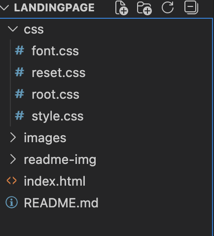
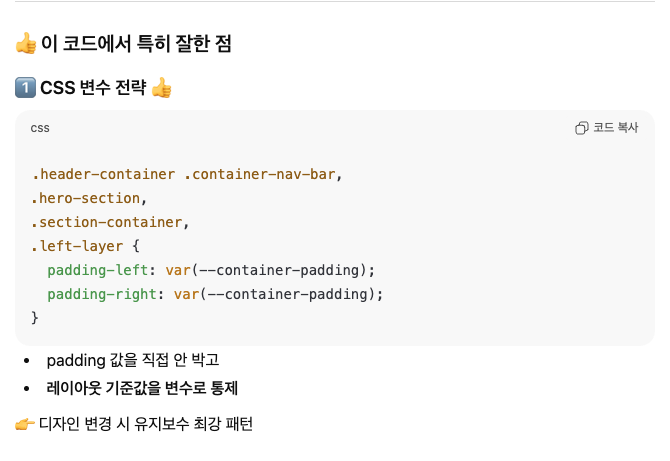
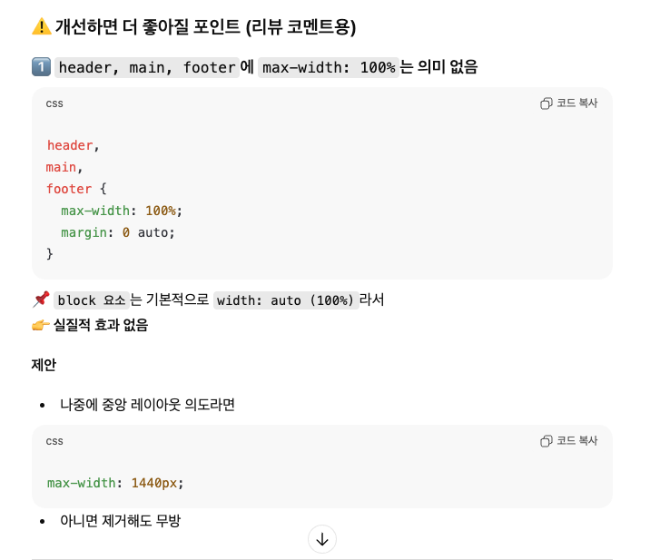

# landing-page

랜딩페이지 반응형 구현

## 구현 일정

## 파일 구조

## 구현 포인트

### 시멘틱 마크업

- `section` `aside` 등 적절한 활용

### 접근성

1. 웹표준에 준수하는 heading 테크 사용
2. 스크린리더 대응 alt 텍스트 처리

### 모바일 퍼스트 레이아웃 구성

### 미디어 쿼리 (media query) - 3단계 화면 구성

- 태블릿 768px / 데스크톱 1440px 미디어쿼리 적용

### 미디어 쿼리 :root 작성

## 에러

